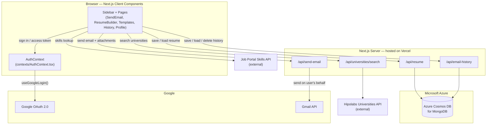
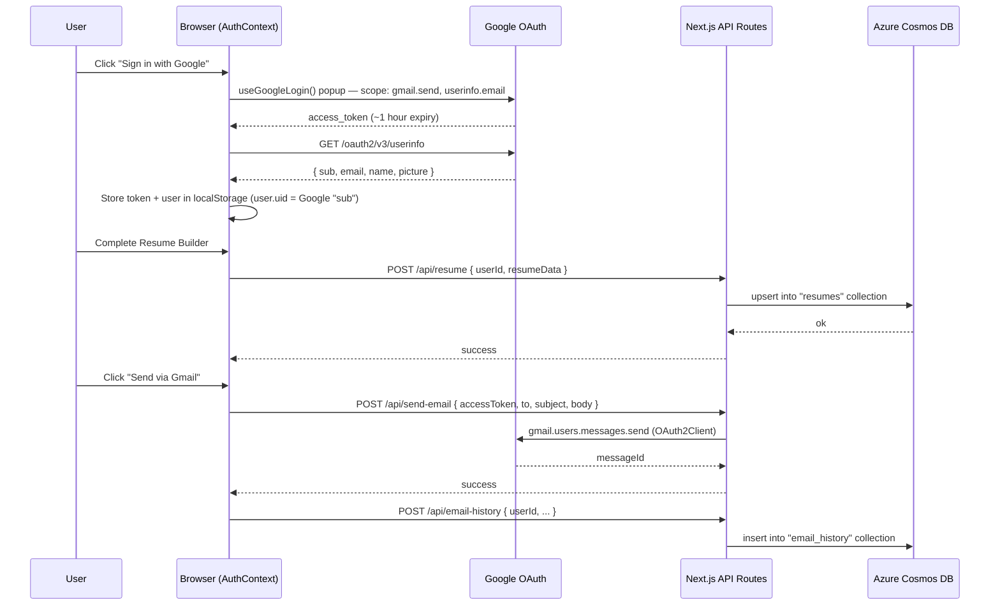
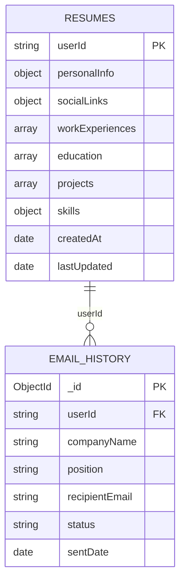

# JobMail — Professional Job Application Email Generator

A modern, feature-rich Next.js application for creating and sending professional job application emails, with direct Google OAuth sign-in, a resume builder backed by MongoDB, and seamless Gmail/Outlook sending.


## 📑 Table of Contents

- [Overview](#-overview)
- [Architecture](#-architecture)
- [Key Features](#-key-features)
- [Technology Stack](#️-technology-stack)
- [Project Structure](#-project-structure)
- [Quick Start](#-quick-start)
- [Environment Variables](#-environment-variables)
- [Usage Guide](#-usage-guide)
- [Security Features](#-security-features)
- [Deployment](#-deployment)
- [Recent Updates](#-recent-updates)
- [Author](#-author)

## 🔭 Overview

JobMail lets a job seeker fill in their profile once (Resume Builder), then generate and send tailored job-application emails through their own Gmail account — with attachments — in a couple of clicks. Everything runs on a small, provider-agnostic stack: **Next.js** for the app, **direct Google OAuth** for sign-in and Gmail permission, and **MongoDB** (Azure Cosmos DB for MongoDB) for storing resumes and send history.

## 🏗 Architecture

### System overview



### Sign-in and data flow



### Data model (MongoDB)



**Why this shape:** authentication is deliberately decoupled from storage. `AuthContext` only ever produces a `userId` (Google's stable `sub` claim) and an access token; every API route treats that `userId` as an opaque string. That's what made it possible to swap Firebase Auth for direct Google OAuth without touching the database layer at all.

## ✨ Key Features

### 🔐 Authentication & Security

- **Direct Google OAuth 2.0** — sign-in via `@react-oauth/google`, no third-party auth provider in the loop
- **Gmail-scoped access token** — requested once at sign-in, used to send mail as the user via the Gmail API
- **Protected Routes** — locked tabs and features for unauthenticated users
- **Auto Cache Clearing** — privacy-focused cache management on sign-out

### 📧 Email Management

- **Multiple Email Templates** — Professional, Creative, Formal, and Technical templates
- **Real-Time Preview** — see your email as you compose it
- **Gmail API Integration** — send emails directly, with attachments
- **Outlook Support** — `mailto:` integration for Outlook users
- **Email History** — track all sent applications
- **Copy to Clipboard** — quick copy functionality

### 👤 Resume Builder

- **Personal Information Management** — store and manage your professional details
- **Multiple Experience Entries** — add unlimited work experiences
- **Education Tracking** — record your academic background
- **Skills Management** — organize technical and soft skills, with API-backed suggestions
- **Auto-Fill Integration** — automatically populate email templates

### 🎨 Modern UI/UX

- **Responsive Design** — works on desktop, tablet, and mobile
- **Sidebar Navigation** — easy access to all features
- **Lock Icons** — clear visual indicators for protected features
- **Confirmation Dialogs** — prevent accidental actions

## 🛠️ Technology Stack

| Layer | Technology |
| --- | --- |
| Frontend | Next.js 14 (App Router), TypeScript, React |
| Styling | Tailwind CSS, Shadcn/ui components |
| Authentication | Direct Google OAuth 2.0 (`@react-oauth/google`) |
| Database | MongoDB driver → Azure Cosmos DB for MongoDB |
| Email sending | Gmail API (`googleapis`), `mailto:` for Outlook |
| Hosting | Vercel |
| Icons | Lucide React |
| State management | React Context API |

## 📁 Project Structure

```
Job_Email_Generator/
├── app/
│   ├── api/
│   │   ├── resume/route.ts            # Resume CRUD (MongoDB)
│   │   ├── email-history/route.ts     # Email history CRUD (MongoDB)
│   │   ├── send-email/route.ts        # Gmail API send
│   │   └── universities/search/route.ts
│   ├── pages/
│   │   ├── SendEmail.tsx              # Email composition page
│   │   ├── ResumeBuilder.tsx          # Personal info management
│   │   ├── EmailTemplates.tsx         # Template selection
│   │   ├── History.tsx                # Email history
│   │   └── Profile.tsx                # User profile & settings
│   ├── globals.css                    # Global styles
│   ├── layout.tsx                     # Root layout
│   ├── providers.tsx                  # GoogleAuthProvider + AuthProvider
│   └── page.tsx                       # Main app container (sidebar shell)
├── components/
│   ├── sidebar-01/                    # Navigation sidebar
│   ├── ui/                            # UI components
│   ├── alert-dialog.tsx               # Alert system
│   ├── google-sign-in.tsx             # Sign-in button
│   └── google-auth-provider.tsx       # GoogleOAuthProvider wrapper
├── contexts/
│   └── AuthContext.tsx                # Auth state (Google OAuth, session persistence)
└── lib/
    ├── emailTemplate.ts               # Email generation
    ├── emailTemplateGenerator.ts      # Template engine
    ├── gmailClient.ts                 # Gmail API client helpers
    ├── resumeDataService.ts           # Resume data API client (MongoDB)
    ├── emailHistoryService.ts         # History API client (MongoDB)
    ├── mongodb.ts                     # MongoDB client singleton
    └── clearCache.ts                  # Cache utilities
```

## 🚀 Quick Start

### Prerequisites

- Node.js 18+ installed
- npm or yarn package manager
- A Google Cloud Console project (OAuth client for sign-in + Gmail API enabled)
- A MongoDB-compatible database — Azure Cosmos DB for MongoDB (free tier) recommended

### Installation

1. **Clone the repository:**

```bash
git clone https://github.com/yourusername/Job_Email_Generator.git
cd Job_Email_Generator
```

2. **Install dependencies:**

```bash
npm install
```

3. **Set up environment variables:**

```bash
cp .env.local.example .env.local
```

Fill in the values — see [Environment Variables](#-environment-variables) below.

4. **Start the development server:**

```bash
npm run dev
```

5. **Open [http://localhost:3000](http://localhost:3000)**

## 🔑 Environment Variables

Defined in `.env.local.example`; copy to `.env.local` (and `.env.production.local` for a production build) and fill in real values. Both files are gitignored.

| Variable | Used for | Where to get it |
| --- | --- | --- |
| `NEXT_PUBLIC_GOOGLE_CLIENT_ID` | Google sign-in popup (client-side) | [Google Cloud Console → Credentials](https://console.cloud.google.com/apis/credentials) |
| `GOOGLE_CLIENT_SECRET` | Reserved for a future server-side token exchange; not required by the current implicit OAuth flow | Same as above |
| `MONGODB_URI` | Resume + email history storage | Azure Portal → Azure Cosmos DB for MongoDB → Connection Strings |
| `NEXT_PUBLIC_SKILLS_API_KEY` | Skills autosuggest in Resume Builder | Job Portal Skills API |
| `NEXT_PUBLIC_SKILLS_API_BASE_URL` | Skills API base URL | Job Portal Skills API |

## 📖 Usage Guide

### First Time Setup

1. **Sign In with Google** — click "Sign in with Google" in the header
2. **Complete Resume Builder** — go to "Your Information" and fill in your details
3. **Create an Email** — go to "Send Email" and compose your first application

### Sending an Email

1. **Fill Application Details:** Company Name, Position/Role, Recipient Email, Email Template
2. **Upload Files:** CV (required), Cover Letter (optional)
3. **Choose Email Client:** Gmail (direct API sending) or Outlook (opens default mail client)
4. **Send or Copy:** "Send via Gmail" for direct sending, "Copy Email" for manual sending

### Managing Your Profile

- View email statistics (sent/total)
- Export your data (JSON format)
- Clear application cache
- Sign out with confirmation
- Delete account (with safeguards)

## 🔒 Security Features

### Authentication Guards

- **Locked Navigation** — "Your Information" tab shows a lock icon when signed out
- **Disabled Buttons** — Resume Builder button locked until authenticated
- **Tooltip Guidance** — "Sign in to access" messages on locked features
- **Visual Feedback** — reduced opacity and cursor changes for locked elements

### Privacy Controls

- **Secure Sign Out** — clears all browser cache and session data
- **Cache Management** — clear cache option in Profile settings
- **Data Export** — download all your data before deletion
- **Account Deletion** — complete data removal with confirmation

## 🚢 Deployment

### Vercel (current host)

The app auto-deploys via Vercel's GitHub integration on every push to `main` — no workflow file needed for that part. Environment variables (same as `.env.local`) are configured separately in **Vercel Dashboard → Project → Settings → Environment Variables**; they are *not* read from any local `.env*` file.

### CI/CD on GitHub

- `.github/workflows/ci.yml` — runs typecheck + build on every push/PR to `main`
- `.github/workflows/release.yml` — tag a version (`git tag vX.Y.Z && git push origin vX.Y.Z`) and it auto-creates a GitHub Release with generated notes

### Other Platforms

- **Netlify** — static site deployment
- **Azure App Service** — Linux/Node hosting with a free tier
- **Custom VPS** — Node.js hosting

## 📝 Recent Updates

- ✅ Added GitHub Actions CI (typecheck + build) and tag-triggered release automation
- ✅ Migrated authentication off Firebase to direct Google OAuth; moved database to Azure Cosmos DB for MongoDB (hosting stays on Vercel)
- ✅ Implemented locked tabs for unauthenticated users
- ✅ Added Sign Out button in Profile settings
- ✅ Auto cache clearing on sign-out
- ✅ Fixed sign-in persistence bug
- ✅ Resume data auto-reload on authentication change
- ✅ Lock icons on protected features
- ✅ Confirmation dialogs for critical actions

## 🤝 Contributing

Contributions are welcome! Feel free to:

- Fork the repository
- Create a feature branch
- Submit a pull request

## 📄 License

MIT License — free to use for personal and commercial projects

## 👨‍💻 Author

**Chamath Dilshan**

- Portfolio: [chamathdilshan.com](https://chamathdilshan.com)
- Email: dilshancolonne123@gmail.com
- Phone: +94 775 616 104

## 🙏 Acknowledgments

- Google for OAuth & Gmail API
- Microsoft Azure for Cosmos DB
- Vercel for hosting
- Shadcn/ui for beautiful components

---

Made with ❤️ by Chamath Dilshan • [Privacy Policy](/privacy) • [Terms of Service](/terms)
