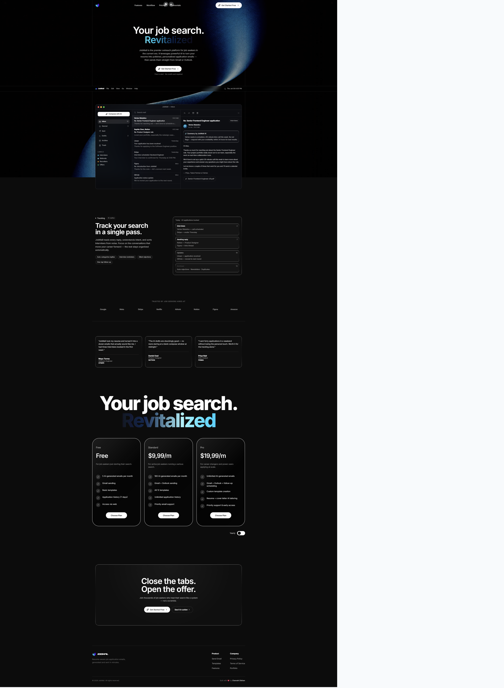
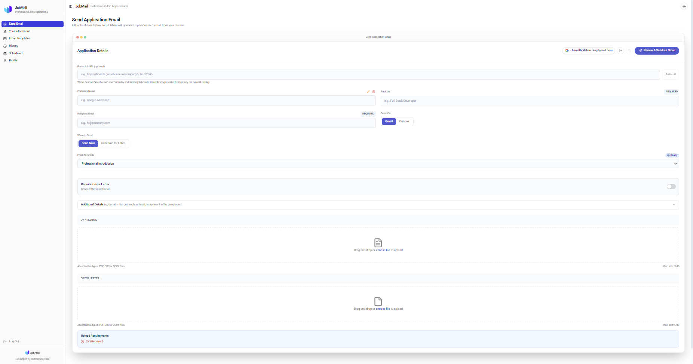
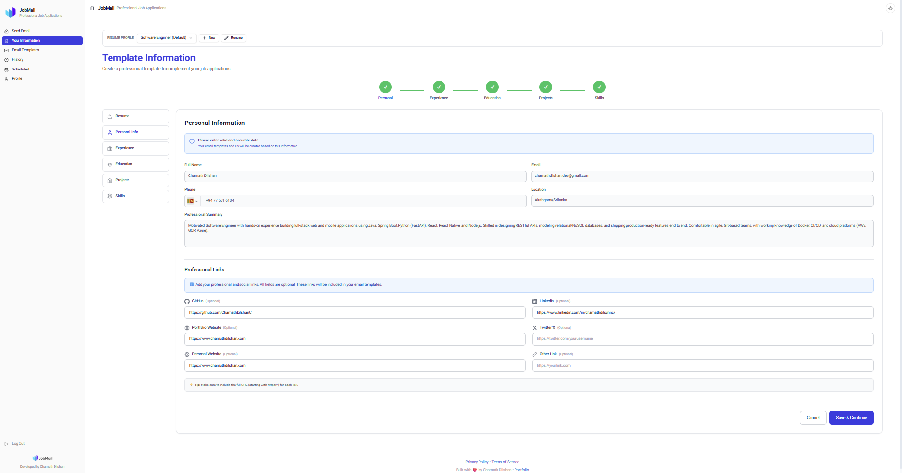
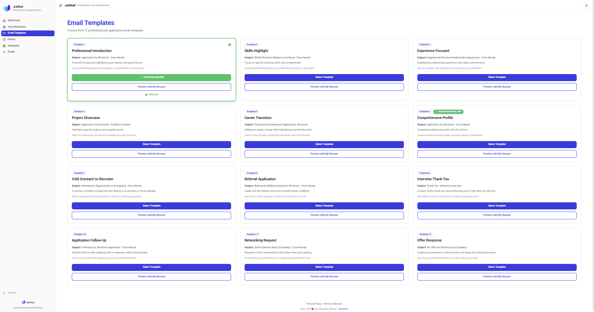
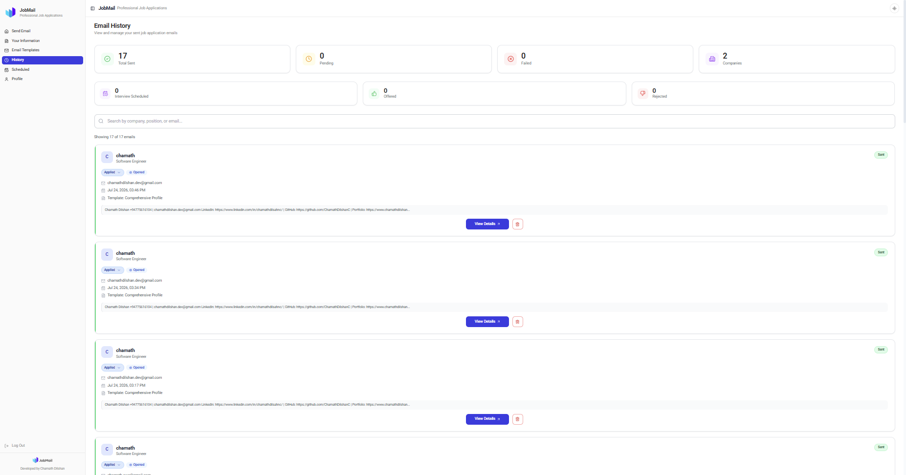
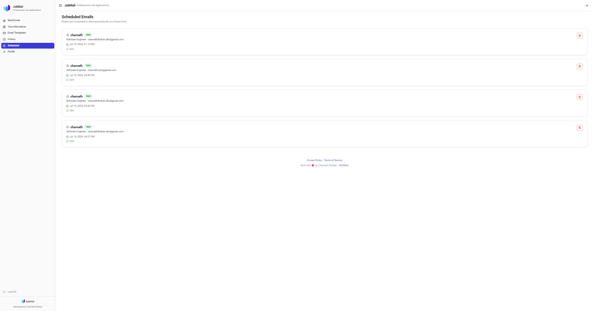
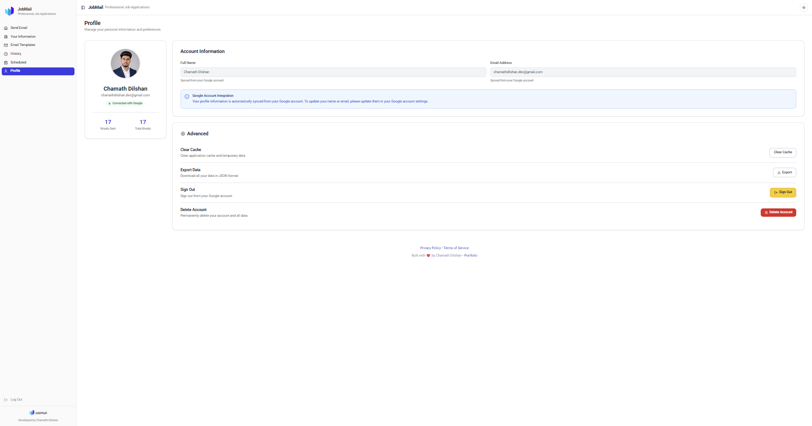
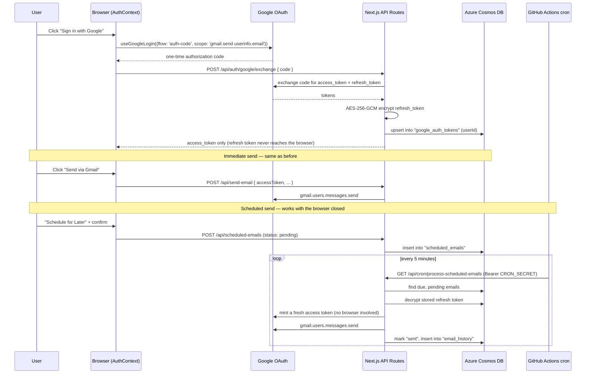
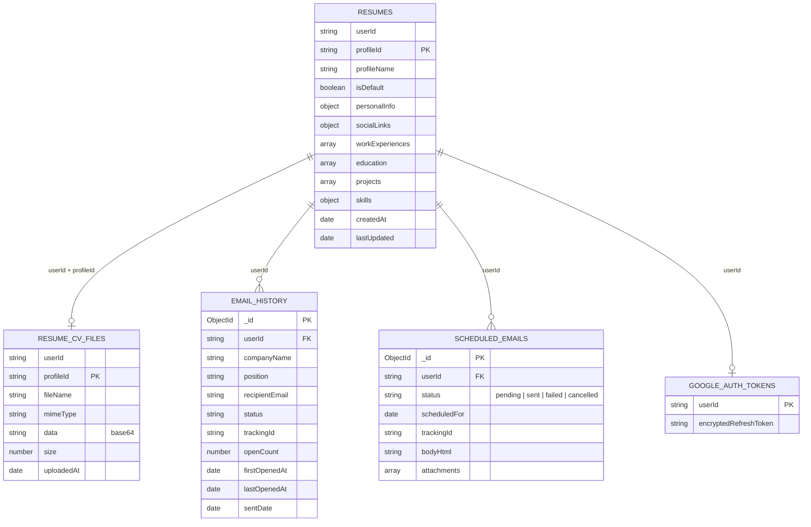

# JobMail — Professional Job Application Email Generator

A modern, feature-rich Next.js application for creating and sending professional job application emails, with server-side Google OAuth (background Gmail sending included), an AI-powered resume builder backed by MongoDB, scheduled sends with open tracking, and seamless Gmail/Outlook sending.


**Live:** [jobemail.me](https://www.jobemail.me)

## 📑 Table of Contents

- [Overview](#-overview)
- [Screenshots](#-screenshots)
- [Architecture](#-architecture)
- [Key Features](#-key-features)
- [Technology Stack](#️-technology-stack)
- [Project Structure](#-project-structure)
- [Quick Start](#-quick-start)
- [Environment Variables](#-environment-variables)
- [Usage Guide](#-usage-guide)
- [Security Features](#-security-features)
- [Deployment](#-deployment)
- [Recent Updates](#-recent-updates)
- [Author](#-author)

## 🔭 Overview

JobMail lets a job seeker fill in their profile once — either by hand or by uploading an existing resume and letting AI fill it in — then generate and send tailored job-application emails through their own Gmail account, with attachments, in a couple of clicks. Emails can go out immediately or be scheduled for later and still send in the background, even if the browser is closed. Everything runs on a small stack: **Next.js** for the app, **Google OAuth** (server-side auth-code flow) for sign-in, Gmail access, and background sending, **Google Gemini** for AI resume parsing, and **MongoDB** (Azure Cosmos DB for MongoDB) for storage.

Signed-out visitors land on a marketing landing page; signing in switches to the app shell (sidebar + pages), all rendered client-side at `/`.

## 📸 Screenshots

**Landing page** — what signed-out visitors see at [jobemail.me](https://www.jobemail.me)



**Send Email** — compose, auto-fill from a job URL, pick a template, send via Gmail or Outlook



**Resume Builder** — the 5-step wizard (shown here fully completed, all steps green)



**Email Templates** — all 12 built-in templates, with a live preview against your own resume data



**Email History** — stats, application pipeline, and every sent email in one place



**Scheduled Emails** — queued and sent-in-the-background applications



**Profile** — account info, cache/export controls, sign out, delete account



## 🏗 Architecture

### System overview


```mermaid
graph TB
    subgraph Browser["Browser — Next.js Client Components"]
        Landing["Landing Page\n(signed out)"]
        UI["Sidebar + Pages\n(SendEmail, ResumeBuilder, Templates,\nHistory, Scheduled, Profile)"]
        AuthCtx["AuthContext"]
    end

    subgraph Server["Next.js Server — hosted on Vercel"]
        RAuth["/api/auth/google/exchange, /status"]
        RResume["/api/resume, /api/resume/cv,\n/api/resume/parse"]
        RHist["/api/email-history"]
        RSend["/api/send-email"]
        RSched["/api/scheduled-emails"]
        RCron["/api/cron/process-scheduled-emails"]
        RTrack["/api/track/[trackingId]"]
        RJob["/api/job-url/parse"]
        RUni["/api/universities/search"]
    end

    subgraph AzureCloud["Microsoft Azure"]
        Cosmos[("Azure Cosmos DB\nfor MongoDB")]
    end

    subgraph GoogleCloud["Google"]
        OAuth["Google OAuth 2.0\n(auth-code flow)"]
        Gmail["Gmail API"]
        Gemini["Gemini API\n(gemini-3.6-flash)"]
    end

    GHA["GitHub Actions\nscheduled-email-cron.yml\n(every 5 min)"]
    Skills["Job Portal Skills API"]
    Uni["Hipolabs Universities API"]
    JobPosting["Job posting page\n(Greenhouse/Lever/etc.)"]

    UI -- "sign in (auth-code)" --> AuthCtx
    AuthCtx -- "useGoogleLogin()" --> OAuth
    AuthCtx -- "POST code" --> RAuth
    RAuth -- "exchange + encrypt\nrefresh token" --> OAuth
    RAuth --> Cosmos

    UI -- "save/load resume + CV file" --> RResume
    UI -- "upload resume PDF/DOC/DOCX" --> RResume
    RResume -- "extract + structure" --> Gemini
    UI -- "save/load history" --> RHist
    UI -- "send now + attachments" --> RSend
    UI -- "schedule for later" --> RSched
    UI -- "paste job URL" --> RJob
    RJob --> JobPosting
    UI -- "university search" --> RUni
    UI -- "skills lookup" --> Skills

    RSend -- "send on user's behalf" --> Gmail
    RSend --> RTrack
    GHA -- "Bearer CRON_SECRET" --> RCron
    RCron -- "mint access token from\nstored refresh token" --> OAuth
    RCron -- "send" --> Gmail

    RResume --> Cosmos
    RHist --> Cosmos
    RSend --> Cosmos
    RSched --> Cosmos
    RCron --> Cosmos
    RTrack --> Cosmos
    RUni --> Uni
```

### Sign-in and background Gmail access

Sign-in uses the **auth-code** OAuth flow (not the older implicit flow) specifically so scheduled emails can send later without the browser open:


```mermaid
sequenceDiagram
    participant U as User
    participant B as Browser (AuthContext)
    participant G as Google OAuth
    participant API as Next.js API Routes
    participant DB as Azure Cosmos DB
    participant GHA as GitHub Actions cron

    U->>B: Click "Sign in with Google"
    B->>G: useGoogleLogin({flow: 'auth-code', scope: 'gmail.send userinfo.email'})
    G-->>B: one-time authorization code
    B->>API: POST /api/auth/google/exchange { code }
    API->>G: exchange code for access_token + refresh_token
    G-->>API: tokens
    API->>API: AES-256-GCM encrypt refresh_token
    API->>DB: upsert into "google_auth_tokens" (userId)
    API-->>B: access_token only (refresh token never reaches the browser)

    Note over U,DB: Immediate send — same as before
    U->>B: Click "Send via Gmail"
    B->>API: POST /api/send-email { accessToken, ... }
    API->>G: gmail.users.messages.send

    Note over U,GHA: Scheduled send — works with the browser closed
    U->>B: "Schedule for Later" + confirm
    B->>API: POST /api/scheduled-emails (status: pending)
    API->>DB: insert into "scheduled_emails"
    loop every 5 minutes
        GHA->>API: GET /api/cron/process-scheduled-emails (Bearer CRON_SECRET)
        API->>DB: find due, pending emails
        API->>DB: decrypt stored refresh token
        API->>G: mint a fresh access token (no browser involved)
        API->>G: gmail.users.messages.send
        API->>DB: mark "sent", insert into "email_history"
    end
```

### Data model (MongoDB, `job_email_generator` database)


```mermaid
erDiagram
    RESUMES {
        string userId
        string profileId PK
        string profileName
        boolean isDefault
        object personalInfo
        object socialLinks
        array  workExperiences
        array  education
        array  projects
        object skills
        date   createdAt
        date   lastUpdated
    }
    RESUME_CV_FILES {
        string userId
        string profileId PK
        string fileName
        string mimeType
        string data "base64"
        number size
        date   uploadedAt
    }
    GOOGLE_AUTH_TOKENS {
        string userId PK
        string encryptedRefreshToken
    }
    EMAIL_HISTORY {
        ObjectId _id PK
        string userId FK
        string companyName
        string position
        string recipientEmail
        string status
        string trackingId
        number openCount
        date   firstOpenedAt
        date   lastOpenedAt
        date   sentDate
    }
    SCHEDULED_EMAILS {
        ObjectId _id PK
        string userId FK
        string status "pending | sent | failed | cancelled"
        date   scheduledFor
        string trackingId
        string bodyHtml
        array  attachments
    }
    RESUMES ||--o| RESUME_CV_FILES : "userId + profileId"
    RESUMES ||--o{ EMAIL_HISTORY : "userId"
    RESUMES ||--o{ SCHEDULED_EMAILS : "userId"
    RESUMES ||--o| GOOGLE_AUTH_TOKENS : "userId"
```

**Why this shape:** authentication is deliberately decoupled from storage — every API route treats `userId` (Google's stable `sub` claim) as an opaque string. The CV file blob lives in its own collection (`resume_cv_files`), separate from the `resumes` wizard document, so a normal resume-data load never has to pull a multi-MB base64 blob along with it — only Send Email's "load the CV for this profile" path touches it.

## ✨ Key Features

### 🔐 Authentication & Security

- **Server-side Google OAuth (auth-code flow)** — sign-in via `@react-oauth/google`, with the authorization code exchanged server-side (`/api/auth/google/exchange`)
- **Encrypted refresh tokens** — AES-256-GCM encrypted at rest in MongoDB (`google_auth_tokens`), enabling scheduled emails to send in the background with no browser involved; the refresh token itself never reaches client JavaScript
- **Protected routes** — locked nav items and disabled buttons for unauthenticated users
- **SSRF-guarded job URL scraper** — rejects loopback/private/link-local addresses on every DNS-resolved IP (defends against DNS-rebinding), before fetching a pasted job posting URL
- **Auto cache clearing** on sign-out; account deletion cascades resume profiles, tagged CV files, and email history

### 📧 Email Management

- **12 built-in templates** — Professional Intro, Skills Highlight, Experience Focused, Project Showcase, Career Transition, Comprehensive Profile, Cold Outreach, Referral Application, Interview Thank You, Follow-up Check-in, Networking/Informational, Offer Response
- **Job URL auto-fill** — paste a posting link (Greenhouse/Lever/Workday-style boards work best) and company/position are extracted via JSON-LD → OpenGraph → title-parsing, in that order
- **Rich text body editor** — live-rendered preview by default, with an opt-in Quill editor (edit → regenerate-from-template → preview-before-send loop)
- **Gmail API direct send** with attachments, or an Outlook `mailto:` fallback for everyone else
- **Schedule for later (Gmail)** — pick a future date/time; a GitHub Actions cron job hits a protected endpoint every 5 minutes and sends due emails even if you're not signed in at that moment
- **Open tracking (opt-in)** — a "Track Email Opens" toggle (off by default) embeds an invisible pixel that records open count and first/last-opened time, for both immediate and scheduled sends. Off by default because a hidden tracking pixel is a well-known spam-filter signal — for a job application, landing in the inbox matters more than knowing if it was opened.
- **Email History with live open-status updates** — stats (sent/pending/failed/companies) plus a small application "pipeline" view (interview scheduled/offered/rejected). While the History page is open, it silently re-checks for new opens every 15 seconds (paused when the tab isn't visible) and updates the "Opened" badge on a card automatically — no manual refresh needed to see when a recruiter opens your email.

### 👤 Resume Builder

- **Multiple named resume profiles** per user, with one marked default — create, rename, delete, switch
- **5-step wizard** (Personal, Experience, Education, Projects, Skills) that autosaves each step to MongoDB
- **AI-powered resume upload** — drop a PDF, DOC, or DOCX and Google Gemini (`gemini-3.6-flash`) reads it and auto-fills every step of the wizard for you (with a confirmation prompt if the profile already has data)
- **Tagged CV storage** — the uploaded file itself (not just the parsed data) is kept, tagged to that resume profile, so **Send Email auto-attaches the right CV** the moment you pick a profile — overridable per-send with a manual upload
- **Skills and Education autosuggest** — position-based skill suggestions and university/degree autocomplete via external APIs

### 🎨 Modern UI/UX

- **Landing page** for signed-out visitors — hero, feature highlights, testimonials, and pricing sections in an "Aura" visual style (pricing/testimonials are illustrative marketing copy; there is no billing/payment integration in this app)
- **goey-toast notifications** app-wide for one-way notices (success/error/info/warning); confirmation dialogs are reserved for real yes/no decisions (delete, sign out, discard changes)
- **Dark/light theme toggle**, responsive layout, and a sticky section sidebar in Resume Builder
- **Lock icons and tooltip guidance** on features that require signing in

## 🛠️ Technology Stack

| Layer | Technology |
| --- | --- |
| Frontend | Next.js 14 (App Router), TypeScript, React |
| Styling | Tailwind CSS, Shadcn/ui components, Framer Motion (page/section animation) |
| Authentication | Google OAuth 2.0 auth-code flow (`@react-oauth/google` + `googleapis`), AES-256-GCM encrypted refresh tokens |
| Database | MongoDB driver → Azure Cosmos DB for MongoDB |
| AI resume parsing | Google Gemini API (`@google/genai`, `gemini-3.6-flash`), `mammoth` for DOCX text extraction |
| Email sending | Gmail API (`googleapis`), `mailto:` for Outlook |
| Rich text editing | `react-quill-new` |
| Scheduling | GitHub Actions cron (5-minute schedule) → protected Next.js API route |
| Job URL parsing | `cheerio` (HTML parsing) with SSRF guards |
| Notifications | `goey-toast` |
| Hosting | Vercel |
| Icons | Lucide React |
| State management | React Context API |

## 📁 Project Structure

```
Job_Email_Generator/
├── app/
│   ├── api/
│   │   ├── auth/google/exchange/route.ts   # Auth-code → tokens, encrypts + stores refresh token
│   │   ├── auth/google/status/route.ts     # Does this user have a stored refresh token?
│   │   ├── resume/route.ts                 # Resume profile CRUD (MongoDB)
│   │   ├── resume/cv/route.ts              # Tagged CV file storage (its own collection)
│   │   ├── resume/parse/route.ts           # AI resume parsing entry point (PDF/DOC/DOCX)
│   │   ├── email-history/route.ts          # Email history CRUD
│   │   ├── send-email/route.ts             # Gmail API send
│   │   ├── scheduled-emails/route.ts       # Schedule / list / cancel / delete
│   │   ├── cron/process-scheduled-emails/route.ts  # Cron-only: sends due emails
│   │   ├── track/[trackingId]/route.ts     # Open-tracking pixel
│   │   ├── job-url/parse/route.ts          # SSRF-guarded job posting scraper
│   │   └── universities/search/route.ts
│   ├── pages/
│   │   ├── SendEmail.tsx                   # Compose, schedule, edit body, send
│   │   ├── ResumeBuilder.tsx               # Wizard + AI Resume upload tab
│   │   ├── EmailTemplates.tsx              # Template gallery + preview
│   │   ├── History.tsx                     # Sent email history + stats
│   │   ├── Scheduled.tsx                   # Pending/sent/failed scheduled emails
│   │   └── Profile.tsx                     # Account, cache, export, delete
│   ├── components/
│   │   ├── landing/                        # Signed-out marketing landing page
│   │   ├── ResumeUploadSection.tsx         # AI resume upload tab UI
│   │   ├── ResumeProfileSwitcher.tsx       # Create/rename/delete/switch profiles
│   │   ├── EmailBodyEditor.tsx             # Quill rich-text editor
│   │   └── AuthGate.tsx                    # Landing page vs. app shell
│   ├── globals.css
│   ├── layout.tsx
│   ├── providers.tsx                       # Theme, Google OAuth, Auth, GooeyToaster
│   └── page.tsx                            # AuthGate → Dashboard
├── components/
│   ├── sidebar-01/                         # Navigation sidebar
│   ├── ui/                                 # Shadcn/ui primitives
│   ├── job-file-upload.tsx                 # Manual CV/cover-letter upload widget
│   ├── confirm-dialog.tsx                  # Yes/no confirmations
│   └── google-sign-in.tsx
├── contexts/
│   └── AuthContext.tsx                     # Auth-code sign-in, session persistence
└── lib/
    ├── resumeAiParser.ts                   # Gemini call + JSON-schema extraction
    ├── resumeDataService.ts                # Resume + CV file API client
    ├── scheduledEmailService.ts            # Scheduled-email API client
    ├── googleAuth.ts                       # OAuth2 client, token encryption, refresh
    ├── sendGmail.ts                        # Gmail send helper (used by the cron route)
    ├── emailTemplateGenerator.ts           # Template engine (12 templates)
    ├── toast.ts                            # Shared showToast() wrapper (goey-toast)
    └── mongodb.ts                          # MongoDB client singleton
```

## 🚀 Quick Start

### Prerequisites

- Node.js 18+ installed
- npm or yarn package manager
- A Google Cloud Console project (OAuth client with the Gmail API enabled)
- A MongoDB-compatible database — Azure Cosmos DB for MongoDB (free tier) recommended
- A Google Gemini API key (for AI resume parsing) — [aistudio.google.com/apikey](https://aistudio.google.com/apikey)

### Installation

1. **Clone the repository:**

```bash
git clone https://github.com/ChamathDilshanC/Job_Email_Generator---Sender-Gmail-Outlook.git
cd Job_Email_Generator---Sender-Gmail-Outlook
```

2. **Install dependencies:**

```bash
npm install
```

3. **Set up environment variables:**

```bash
cp .env.local.example .env.local
```

Fill in the values — see [Environment Variables](#-environment-variables) below.

4. **Start the development server:**

```bash
npm run dev
```

5. **Open [http://localhost:3000](http://localhost:3000)**

## 🔑 Environment Variables

Defined in `.env.local.example`; copy to `.env.local` and fill in real values. Both `.env.local` and `.env.production.local` are gitignored — in production (Vercel), these are set in **Project → Settings → Environment Variables**, not read from a file.

| Variable | Used for | Where to get it |
| --- | --- | --- |
| `NEXT_PUBLIC_GOOGLE_CLIENT_ID` | Google sign-in (client-side) | [Google Cloud Console → Credentials](https://console.cloud.google.com/apis/credentials) |
| `GOOGLE_CLIENT_SECRET` | **Required.** Server-side exchange of the auth-code sign-in flow for tokens (`/api/auth/google/exchange`) — this is what makes background/scheduled sending possible | Same as above |
| `TOKEN_ENCRYPTION_KEY` | Any secret string; derives the AES-256-GCM key that encrypts stored Google refresh tokens at rest | Generate: `node -e "console.log(require('crypto').randomBytes(32).toString('hex'))"` |
| `CRON_SECRET` | Shared secret the scheduled-email cron job presents as `Authorization: Bearer <CRON_SECRET>` | Generate your own random string; also set as a GitHub Actions repo secret of the same name |
| `APP_BASE_URL` | Public base URL of this deployment (no trailing slash) — used by the cron job to build tracking-pixel links, since there's no `window.location` in that context | Your deployment's public URL |
| `MONGODB_URI` | All storage (resumes, CV files, history, scheduled emails, auth tokens) | Azure Portal → Azure Cosmos DB for MongoDB → Connection Strings (or any Mongo-compatible URI) |
| `NEXT_PUBLIC_SKILLS_API_KEY` | Skills autosuggest in Resume Builder | Job Portal Skills API |
| `NEXT_PUBLIC_SKILLS_API_BASE_URL` | Skills API base URL | Job Portal Skills API |
| `GEMINI_API_KEY` | AI resume parsing (Resume Builder's "Resume" upload tab) | [aistudio.google.com/apikey](https://aistudio.google.com/apikey) |

## 📖 Usage Guide

### First Time Setup

1. **Sign In with Google** — from the landing page or header
2. **Fill in Your Information** — either upload an existing resume on the new **Resume** tab and let AI fill it in, or complete the 5-step wizard by hand
3. **Send an email** — go to "Send Email" and compose your first application

### Sending an Email

1. **Fill Application Details** — Company Name, Position, Recipient Email; optionally paste a job posting URL to auto-fill company/position
2. **Pick a resume profile** (if you have more than one) — its tagged CV attaches automatically
3. **Choose a template**, optionally fill in "Additional Details" for scenario templates (referral, interview, offer response, etc.)
4. **Review the email body** — edit it with the rich text editor if you want, or regenerate from the template
5. **Choose Gmail or Outlook**, and **Send Now** or **Schedule for Later** (Gmail only)

### Managing Scheduled Emails

- View pending/sent/failed/cancelled scheduled emails on the **Scheduled** page
- If background sending isn't enabled (no stored refresh token yet), reconnect your Google account from the banner shown there
- Cancel or delete a pending scheduled email at any time before it sends

### Managing Your Profile

- View email statistics (sent/total), export your data (JSON), clear cache
- Sign out with confirmation, or delete your account (removes all resume profiles, tagged CV files, and email history)

## 🔒 Security Features

- **Encrypted refresh tokens at rest** (AES-256-GCM) — the raw refresh token is never stored in plaintext and never sent to the browser
- **Cron endpoint is bearer-secret protected** — `/api/cron/process-scheduled-emails` rejects any request without the correct `CRON_SECRET`, and refuses everything if the secret isn't configured
- **SSRF-guarded URL fetching** — the job-URL parser checks every DNS-resolved address of a pasted URL against loopback/private/link-local ranges before fetching, guarding against DNS-rebinding
- **Tracking pixel never reveals ID validity** — the endpoint always returns the same 1×1 GIF whether or not a tracking ID matches anything real, so it can't be used to enumerate valid IDs
- **Locked navigation & disabled buttons** for unauthenticated users, with tooltip guidance
- **Data export & account deletion** — download all your data as JSON before deleting; deletion cascades resume profiles, tagged CV files, and history

## 🚢 Deployment

### Vercel (current host)

The app auto-deploys via Vercel's GitHub integration on every push to `main`. Environment variables are configured separately in **Vercel Dashboard → Project → Settings → Environment Variables**.

### CI/CD on GitHub

Three workflows under `.github/workflows/`:

- **`ci.yml`** — runs on every push/PR to `main`: install, `next build`, then `tsc --noEmit` (run after the build, since `next build` generates `next-env.d.ts`)
- **`release.yml`** — tag a version (`git tag vX.Y.Z && git push origin vX.Y.Z`) and it auto-creates a GitHub Release with generated notes
- **`scheduled-email-cron.yml`** — the actual driver of scheduled sending: fires every 5 minutes and calls `/api/cron/process-scheduled-emails` with the `CRON_SECRET`. This runs on GitHub Actions rather than Vercel Cron because Vercel's Hobby plan caps cron at once/day; 5-minute granularity needs the Pro plan. Requires a `CRON_SECRET` repository secret matching the env var.

### Other Platforms

- **Netlify**, **Azure App Service**, or any Node.js host work in principle — you'll need to replace `scheduled-email-cron.yml` with an equivalent scheduler on that platform if you move off GitHub Actions.

## 📝 Recent Updates

- ✅ Live-updating Email History — the "Opened" status on each card refreshes automatically (15s polling) with no manual reload
- ✅ Open tracking made opt-in (off by default) — an always-on invisible pixel was a spam-filter red flag; now it's a toggle on Send Email
- ✅ AI-powered resume parsing (Google Gemini) — upload a PDF/DOC/DOCX and auto-fill the entire Resume Builder wizard
- ✅ Tagged CV storage — the uploaded resume file is kept per-profile and auto-attached in Send Email
- ✅ App-wide toast notifications (`goey-toast`), replacing a custom alert-dialog system for one-way notices
- ✅ Scheduled email sending with background Gmail access (server-side OAuth auth-code flow, encrypted refresh tokens, GitHub Actions cron)
- ✅ Email open tracking (invisible pixel, open count + timestamps)
- ✅ Rich text email body editing (Quill) with edit/regenerate/preview-before-send
- ✅ Job posting URL auto-fill (SSRF-guarded scraper)
- ✅ Multiple named resume profiles with a default profile
- ✅ Redesigned landing page and dark mode
- ✅ Migrated authentication off Firebase to Google OAuth; storage on Azure Cosmos DB for MongoDB

See [GitHub Releases](https://github.com/ChamathDilshanC/Job_Email_Generator---Sender-Gmail-Outlook/releases) for the full version history.

## 🤝 Contributing

Contributions are welcome! Feel free to:

- Fork the repository
- Create a feature branch
- Submit a pull request

## 📄 License

GNU Lesser General Public License v2.1 (LGPL-2.1) — see [`LICENSE`](./LICENSE).

## 👨‍💻 Author

**Chamath Dilshan**

- Portfolio: [chamathdilshan.com](https://chamathdilshan.com)
- Email: dilshancolonne123@gmail.com
- Phone: +94 775 616 104

## 🙏 Acknowledgments

- Google for OAuth, Gmail API & Gemini API
- Microsoft Azure for Cosmos DB
- Vercel for hosting
- Shadcn/ui for beautiful components

---

Made with ❤️ by Chamath Dilshan • [Privacy Policy](/privacy) • [Terms of Service](/terms)
